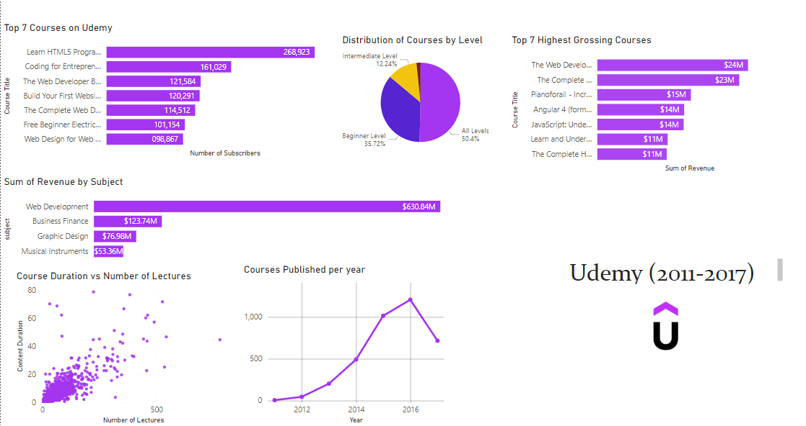

# udemy-courses

# Udemy Course Analysis Visualization 

This documentation outlines the structure and implementation details for the Udemy course analysis dashboard. The visualization provides insights into course performance, revenue, and distribution across various categories. Udemy’s revenue is heavily driven by its web development courses, which teach skills for building websites, applications, and software systems. This dominance reflects the tech industry boom of the early-to-mid 2010s, when Silicon Valley investors funneled billions into technology startups across sectors—from e-commerce to fintech—spurring unprecedented demand for skilled developers. As companies raced to digitize, learners flocked to acquire these lucrative skills, Web development stands as the highest-earning subject, generating $630 million in revenue, while The Web Developer Bootcamp ranks as the top-grossing course, bringing in $24 million.

 

## Overview
The dashboard consists of 7 key visual components analyzing Udemy course data (2011-2017). Built with Power BI, it focuses on:

- Course popularity metrics
- Revenue analysis
- Content distribution
- Temporal trends

## Visualization Components

### 1. Top 7 Courses (Truncated Labels)
 Full name of each course includes 
 - Learn HTML programming from scratch
 - Coding For Entrepreneurs Basic
 - The Web Developer Bootcamp
 - Build Your First Website in 1 Week with HTML5 and CSS3
 - The Complete Web Developer Course 2.0
 - Free Beginner Electric Guitar Lessons
 - Web Design For Web Developers: Build beautiful Websites!

  **Note:** Implement tooltips to show full course names on hover

### 2. Subscriber Count

### 3. Revenue by Subject

### 4. Course Level Distribution

### 5. Highest Grossing Courses
Full name of each course includes
- The Web Developer Bootcamp
- The Complete Web Developer Course 2.0
- Pianoforall - Incredible New Way to Learn Piano & Keyboard
- Javascript: Understanding the Weird Parts
- Learn and Understand NodeJS
- The Complete HTML and CSS Course: From Novice to Professional

